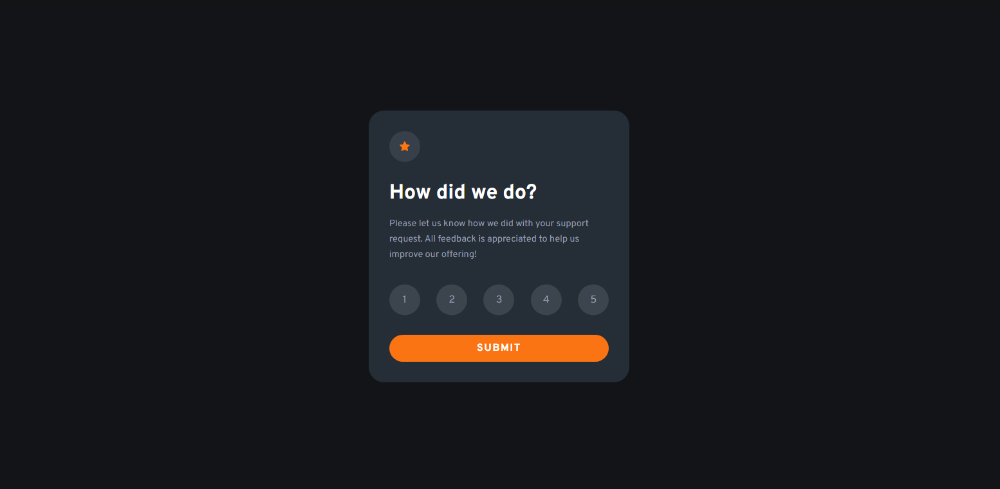
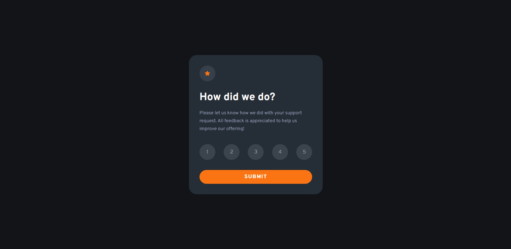
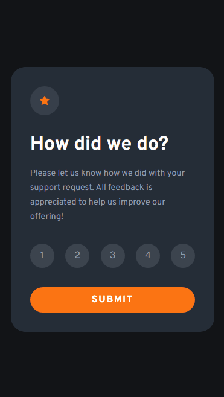

</img>
<h1>Project: Interactive Menu</h1>

Project made with HTML, CSS and JS.

It consists of an interactive evaluation menu, when choosing the grade it switches the screen to a THANK YOU screen and displays which grade the user chose.

  

Projeto feito com HTML, CSS e JS.

Consiste em um menu de avaliação interativo, ao escolher a nota ele troca a tela para uma tela de OBRIGADO e exibe qual nota o usúario escolheu.

  

</img>
</img>

Versão Mobile

</img>

Technologies Used

   <h2>HTML CSS JS</h2>

Made by my👨🏻‍💻

<button><a href="https://sparkly-gingersnap-0d40a7.netlify.app">Access here</a></button>